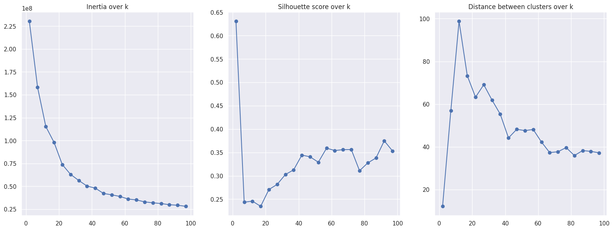
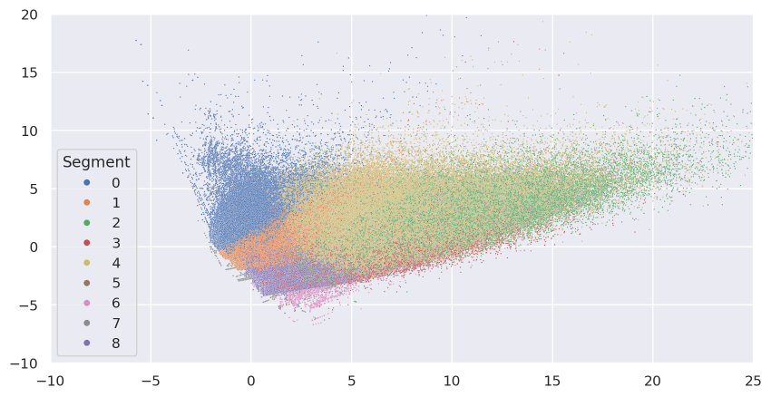
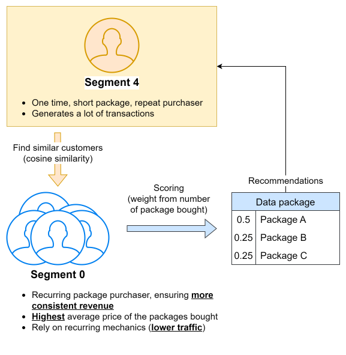

# Executive summary

For mobile operators, one way to increase the revenue generated by selling data packages is through upselling/cross-selling. However, merely examining the number of packages sold may not be the most efficient approach, as it may not align with customer behavior and could become just annoying ads.

The purpose of this project is to identify recommended packages based on customer behavior. By suggesting packages used by similar customers, we can provide options that align with customer needs while still focusing on our main goal: increasing revenue.
  

# The data

This data will be utilized to identify similar customers and make recommendations.

3 months of transactions data
---
|Columns|Description|
|---|---|
|PACKAGE_CODE|Mobile data dackage unique code|
|CHANNEL|Buying channel|
|BUY_DATE|Buying date|
|MSISDN|Customer number|

Package detail
---
The variety properties of each data packages such as
* Maximum speed (Megabit per sec/Mbps)
* Minimum speed (Megabit per sec/Mbps)
* Package quota (megabytes, gigabytes, etc.)
* Service type such as "Normal Internet", "Social", "Streaming", etc.
* Price
* Charging type: One time charging, Recurring
* Package validity (days, months, etc.)
  

# Implementation

With limited compute resources, implementation will be separate into several steps to achieve the result.

1. Instead of solely using Pandas for analysis, Dask DataFrame is employed to conduct exploratory data analysis, particularly for aggregation tasks on the large dataset (52 million transactions approximately).

2. Following the acquisition of aggregated data, we proceed with clustering using K-Means to identify customer segmentation.

\* Silhouette scores are calculated from result sampling and may not be accurate.

3. Building upon the customer segmentation from the previous step, we can discern customer behavior regarding the purchase of mobile data packages, as well as the revenue generated by each segment.

4. Generate recommendations based on customer similarity within different customer segments. For example, for a specific customer, identify similar customers in high revenue segments and calculate package scoring. Utilize the results to make personalized recommendations.

  

# In conclusion

With the obtained recommendation packages, we can enhance the precision of upselling and cross-selling strategies. Additionally, rule-based filtering can be implemented on the list of recommended packages to align with the business rules set by the marketing team. This dual approach ensures not only targeted promotion based on customer preferences but also adherence to specific business criteria, thereby optimizing the effectiveness of the marketing initiatives.

Nevertheless, since the data evolves over time, it becomes imperative to periodically repeat the entire process. This ensures that the recommendations remain consistently relevant and aligned with the latest trends and changes in customer behavior. Regular updates and re-analysis are essential to maintain the effectiveness of the recommendation system and to adapt to the dynamic nature of the market and customer preferences.